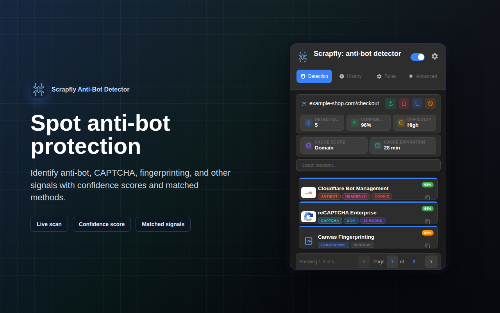
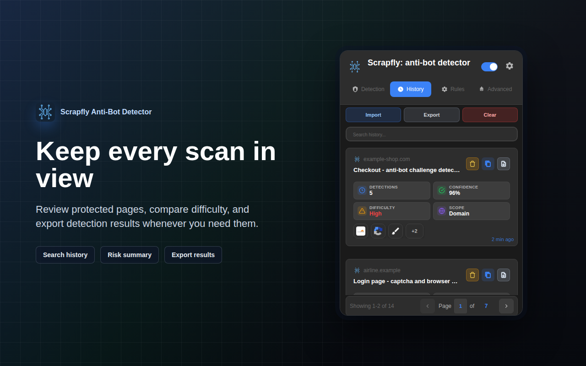
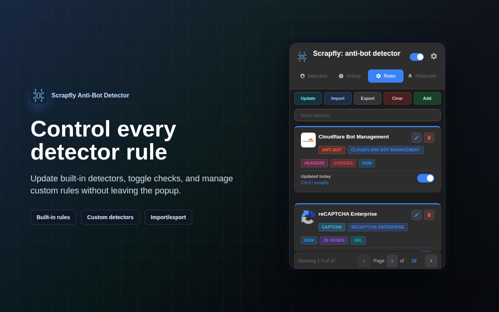
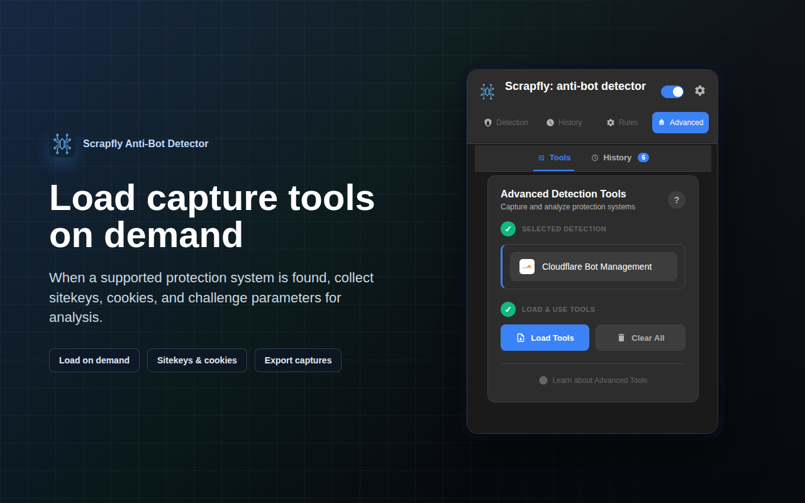
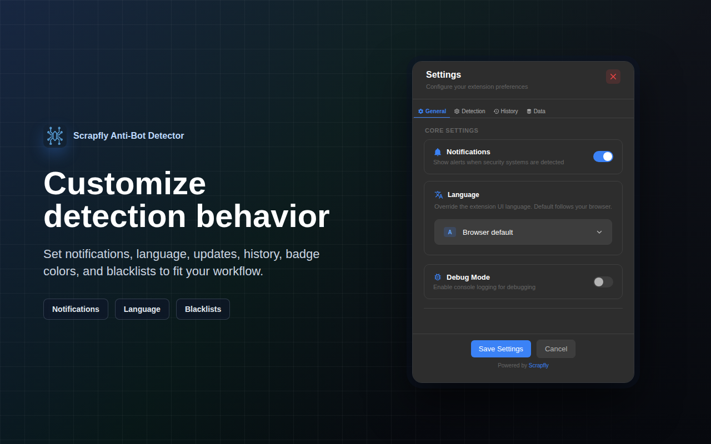

# Scrapfly Anti-bot Detector

<div align="center">


<br>


<br>

**Detect anti-bot systems, CAPTCHAs & browser fingerprinting in real-time**

[Install from Chrome Web Store](https://chromewebstore.google.com/detail/scrapfly/pdpakdgmjhkfimgaihlgaaiijlbilkca)

</div>

---

## Overview

Scrapfly Anti-bot Detector is a Manifest V3 Chrome extension that helps security researchers, web developers, and bot detection enthusiasts identify and analyze:

- **CAPTCHAs**: reCAPTCHA, hCaptcha, FunCaptcha, GeeTest, Cloudflare Turnstile
- **Anti-bot systems**: Cloudflare, Akamai, DataDome, PerimeterX, Shape Security, AWS WAF, Imperva, Kasada, and more
- **Fingerprinting techniques**: Canvas, WebGL, Audio, Font, WebRTC, Performance, Navigator, Storage, and other browser fingerprinting methods

<div align="center">


</div>

## Screenshots

| Detection | History | Rules |
|-----------|---------|-------|
|  |  |  |

| Advanced Tools | Settings |
|----------------|----------|
|  |  |

## Features

### Multi-Layer Detection System

- **DOM Analysis**: Detects scripts, classes, and HTML elements
- **Network Monitoring**: Analyzes cookies, headers, and URLs
- **Payload Analysis**: Inspects request bodies with URL pattern and HTTP method filtering
- **JavaScript Hooks**: Intercepts fingerprinting APIs (Canvas, WebGL, Audio, Performance, Navigator, Storage, etc.) — hook targets are driven entirely by detector definitions, installed synchronously at `document_start`
- **Window Properties**: Checks for anti-bot objects in the global scope

### Modern UI

- **Real-time Detection**: Live detection results with confidence scores
- **Badge Indicator**: Shows detection count on the extension icon
- **Detection History**: Track detected systems across browsing sessions
- **Advanced Capture Tools**: Specialized tools for reCAPTCHA, hCaptcha, FunCaptcha, GeeTest, Akamai, DataDome, Cloudflare Turnstile, Imperva, Shape Security, and AWS WAF
- **Intermediate Page Handling**: Automatically captures data from challenge pages before redirect
- **Rules Editor**: Customize and manage detection rules with full CRUD operations
- **Settings Panel**: Configure cache duration, history limits, URL blacklists, and debug mode

### Performance Optimized

- **Smart Caching**: 12-hour detection cache with background validation and cache-hit early exit
- **Pattern Caching**: LRU cache for compiled regex patterns (60-80% faster)
- **Early Exit**: Stops detection after finding high-confidence matches
- **Lazy Evaluation**: On-demand data collection based on enabled detectors
- **Batched Operations**: Optimized DOM traversal and storage writes
- **Hook Completion**: 2-second inactivity timeout with 8-second maximum window

### Privacy & Security

- **No Data Collection**: All detection happens locally in your browser
- **CSP Compliant**: No inline event handlers or unsafe-eval
- **Context Isolation**: Proper separation between MAIN and ISOLATED worlds
- **Safe Conditions**: Pre-compiled evaluators (no eval/arbitrary code execution)

## Usage

### Basic Detection

1. **Navigate to a Website**: The extension automatically scans pages
2. **Open Popup**: Click the extension icon to view results
3. **View Details**: Click on any detection card to see full details
4. **Copy Results**: Use the copy button to export detection data

### Advanced Capture Tools

| System | Features |
|--------|----------|
| **reCAPTCHA** | Start Capture, Obtain Selector, Extract SiteKey, Callback Detection |
| **Akamai** | Start Capture, Extract Sensor Data |
| **Imperva** | Check Cookies, Analyze Scripts, Start Capture |
| **Shape Security** | Check Headers, Analyze Scripts, Start Capturing |
| **AWS WAF** | Check Cookies, Analyze Scripts |
| **hCaptcha** | Extract SiteKey, Analyze Scripts |
| **FunCaptcha** | Extract Public Key, Analyze Scripts |
| **GeeTest** | Extract Challenge Parameters, Analyze Scripts |
| **DataDome** | Check Cookies, Analyze Scripts |
| **Cloudflare Turnstile** | Extract SiteKey, Analyze Scripts |

### Rules Editor

1. **Browse Detectors**: View all detection rules by category (Anti-Bot, CAPTCHA, Fingerprinting)
2. **Edit Rules**: Modify detection patterns, confidence scores, and settings
3. **Add Methods**: Create new detection methods (Cookie, Header, URL, Content, DOM, Window, JS Hooks, Payload)
4. **Pattern Options**: Configure regex, whole-word, and case-sensitive matching
5. **Import/Export**: Share rules via JSON files

### Settings

- **Cache Duration**: Set detection cache expiry (1-24 hours)
- **History Limit**: Control max history items (10-500)
- **URL Blacklist**: Exclude specific domains from detection
- **Debug Mode**: Enable verbose logging to Service Worker console
- **Auto-cleanup**: Automatic history expiration

## Architecture

### Project Structure

```
core/
├── manifest.json              # Extension configuration (Manifest V3)
├── background.js              # Service worker (message handling, detection)
├── content.js                 # Content script (ISOLATED world - orchestration)
├── content-main-world.js      # JS hooks installer (MAIN world - API interception)
├── popup.js/html/css          # Extension popup UI
│
├── detectors/                 # JSON detector definitions
│   ├── antibot/              # Cloudflare, Akamai, DataDome, Imperva, etc.
│   ├── captcha/              # reCAPTCHA, hCaptcha, FunCaptcha, GeeTest, Turnstile
│   ├── fingerprint/          # Canvas, WebGL, Audio, Performance (21 detectors)
│   └── index.json            # Category configuration
│
├── modules/                   # Core managers & helpers (singleton pattern)
│   ├── core/                 # logger, storage-manager, ttl-map, badge-constants,
│   │                         #   log-collector, update-manager
│   ├── detection/
│   │   ├── engine/           # DetectionEngineManager + analysis/extractors/
│   │   │                     #   matching/hooks helpers (orchestration & batching)
│   │   ├── managers/         # detector-manager, category-manager, confidence-manager
│   │   └── hooks/            # hook-resilience-manager, window-condition-language,
│   │                         #   window-property-tracker, worker-keepalive-manager
│   ├── ui/                   # color-manager, notification-manager, pagination-manager
│   └── styles/               # CSS stylesheets (popup, detection, rules, settings, …)
│
├── sections/                  # UI sections (modular architecture)
│   ├── detection/            # Detection results tab
│   ├── history/              # Detection history tab
│   ├── rules/                # Detector rules editor
│   ├── settings/             # Settings & configuration
│   └── advanced/             # Advanced capture tools
│       ├── base-interceptor-helpers.js    # Service worker utilities
│       ├── advanced-utils.js              # Popup UI utilities
│       ├── base-advanced-module.js        # Base class for modules
│       └── modules/                        # Detector-specific tools
│           ├── recaptcha/
│           ├── akamai/
│           ├── imperva/
│           ├── shapesecurity/
│           ├── awswaf/
│           ├── hcaptcha/
│           ├── funcaptcha/
│           ├── geetest/
│           ├── datadome/
│           └── cloudflare/
│
└── utils/                     # Utility functions
    ├── utils.js              # Core utilities (data collection, URL handling)
    ├── format-utils.js       # HTML escaping & formatting helpers
    ├── url-utils.js          # URL hashing, favicon & locale-flag helpers
    ├── detection-utils.js    # Detection/difficulty helpers
    └── pattern-cache.js      # LRU compiled-regex cache (ReDoS-guarded)
```

> Tooling lives in `scripts/` (verification checks) and `test/` (unit tests). Both stay in the repo for CI but are excluded from the packaged extension. Internal planning notes (`plans/`) are git-ignored.

### Detection Flow

```
┌─────────────────────────────────────────────────────────────┐
│  1. Page Load (document_start)                              │
│     └─> content-main-world.js installs JS hooks             │
│         • Detector-driven fingerprinting API hooks          │
│         • Must install BEFORE page scripts execute          │
└─────────────────────────────────────────────────────────────┘
                          ↓
┌─────────────────────────────────────────────────────────────┐
│  2. Cache Check                                             │
│     └─> background.js cache check (async)                   │
│         • If cache hit: Skip detection, show cached results │
│         • If cache miss: Proceed to data collection         │
└─────────────────────────────────────────────────────────────┘
                          ↓
┌─────────────────────────────────────────────────────────────┐
│  3. Data Collection (content.js - ISOLATED world)           │
│     └─> DetectionEngineManager.collectPageData()            │
│         • DOM elements, scripts, classes                    │
│         • Cookies, headers (via background.js)              │
│         • Window properties (via authenticated bridge)      │
│         • JS hooks (via authenticated bridge)               │
│         • Request payloads (via background.js)              │
└─────────────────────────────────────────────────────────────┘
                          ↓
┌─────────────────────────────────────────────────────────────┐
│  4. Hook Completion (content-main-world.js)                 │
│     └─> Completion triggers:                                │
│         • 2-second inactivity timeout (no hook activity)    │
│         • 8-second maximum window (absolute cap)            │
│     └─> Hooks uninstalled immediately after firing          │
└─────────────────────────────────────────────────────────────┘
                          ↓
┌─────────────────────────────────────────────────────────────┐
│  5. Detection (background.js)                               │
│     └─> DetectionEngineManager.detectOnPage()               │
│         • Pattern matching against enabled detectors        │
│         • Confidence score calculation                      │
│         • Results aggregation & deduplication               │
└─────────────────────────────────────────────────────────────┘
                          ↓
┌─────────────────────────────────────────────────────────────┐
│  6. Storage & Display                                       │
│     └─> Cache results (12-hour expiry)                      │
│     └─> Update badge with detection count                   │
│     └─> Update popup UI with detections                     │
└─────────────────────────────────────────────────────────────┘
```

### Key Design Patterns

- **Singleton Managers**: DetectorManager, CategoryManager, StorageManager for centralized state
- **Event-Driven Communication**: authenticated bridge events for MAIN <-> ISOLATED world communication
- **Modular Sections**: Each UI section is self-contained (JS + HTML + CSS)
- **JSON-Driven Detectors**: All detection rules stored in JSON for easy updates
- **LRU Caching**: Pattern cache, URL hash cache for performance
- **Centralized Logging**: All logs routed to Service Worker console via Logger module
- **CSP Compliance**: Event delegation instead of inline handlers


## Development

No build step — it's pure JavaScript. Load the `src/` folder as an unpacked extension:

1. Open `chrome://extensions/`
2. Enable **Developer mode** (top-right)
3. **Load unpacked** → select this folder
4. After changes, click the reload icon on the extension card

### Verification

```bash
npm run verify        # syntax + structure + locale parity + unit tests
```

Individual checks:

```bash
npm run check:syntax      # node --check across all .js files
npm run check:structure   # HTML tag balance, JSON validity, modal-header pattern
npm run check:locale      # _locales/* key parity across all languages
npm test                  # node:test unit suite
```

Unit tests live in `test/` and run on Node's built-in test runner (zero dependencies). They cover the pattern cache, the window-condition language and Rules-UI fallback parity, the TTL map, confidence scoring, detection-engine storage locking, the worker keepalive, and detection-UI state transitions. CI runs `npm run verify` on every push.

## License

This project is licensed under the **Non-Profit Open Software License 3.0 (NPOSL-3.0)**.

Copyright (c) 2026 Scrapfly


### Full License

See the [LICENSE](LICENSE) file for complete terms and conditions.

---

<div align="center">

</div>


