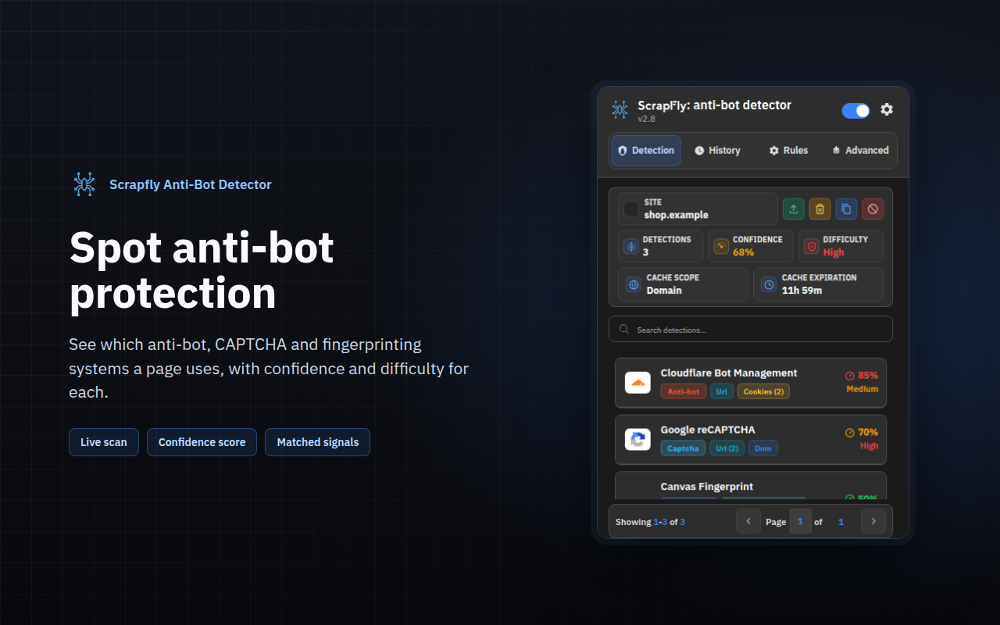
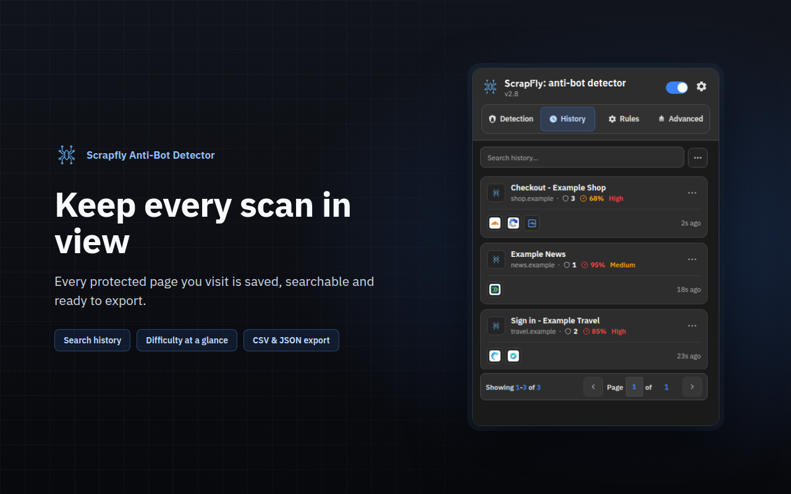
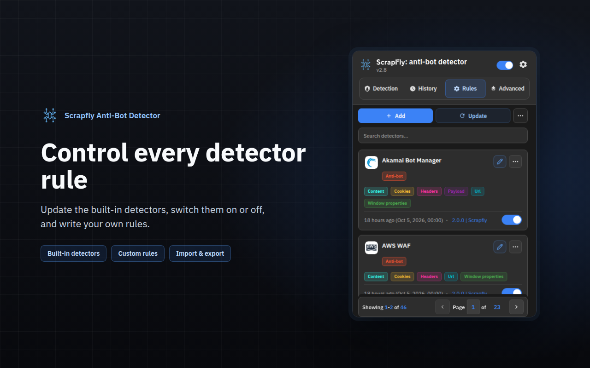
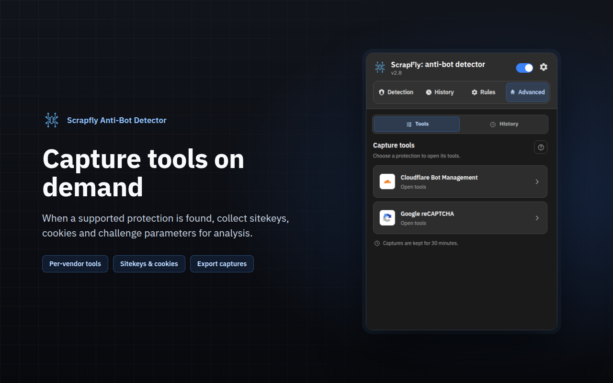
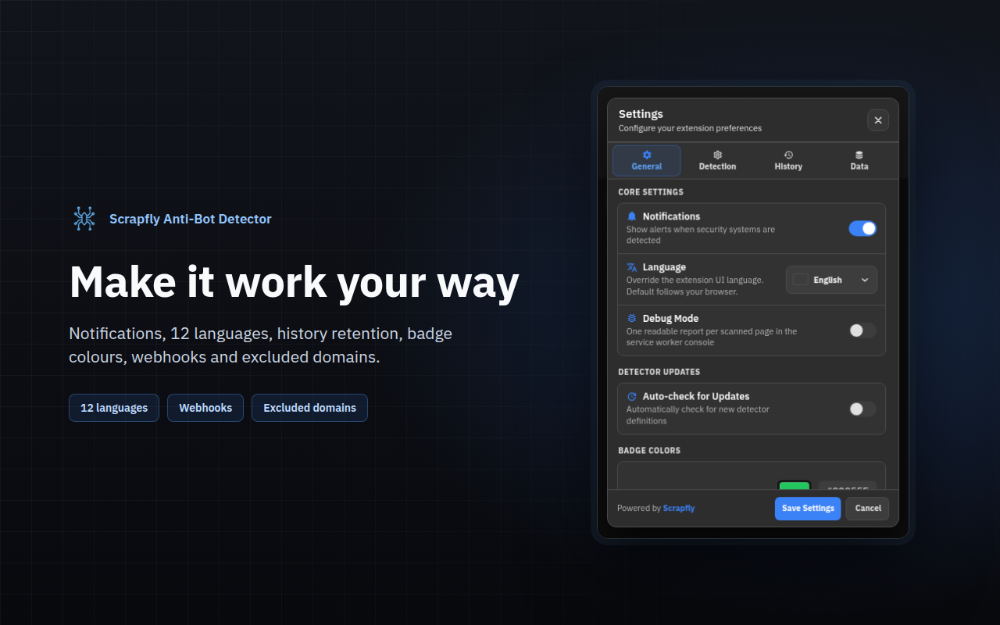

<div align="center">


# Scrapfly Anti-bot Detector

**See how a website defends itself against bots: which anti-bot system, which CAPTCHA, which fingerprinting scripts, and how sure each match is.**

[](https://chromewebstore.google.com/detail/scrapfly-anti-bot-detecto/pdpakdgmjhkfimgaihlgaaiijlbilkca)
[](https://chromewebstore.google.com/detail/scrapfly-anti-bot-detecto/pdpakdgmjhkfimgaihlgaaiijlbilkca)
[](https://chromewebstore.google.com/detail/scrapfly-anti-bot-detecto/pdpakdgmjhkfimgaihlgaaiijlbilkca)
[](https://github.com/scrapfly/Antibot-Detector/actions/workflows/ci.yml)
[](LICENSE)

[**Add to Chrome**](https://chromewebstore.google.com/detail/scrapfly-anti-bot-detecto/pdpakdgmjhkfimgaihlgaaiijlbilkca) · [Product page](https://scrapfly.io/products/antibot-detector) · [What's new](CHANGELOG.md) · [Report a problem](https://github.com/scrapfly/Antibot-Detector/issues)

</div>

---

Scrapfly Anti-bot Detector is a free Chrome extension that shows how a website protects itself from automated traffic. Browse as you normally would: the number on the toolbar icon tells you how many protections the page uses, and the popup lists each one with its confidence, its difficulty and the signals that gave it away.

It recognizes 62 technologies out of the box: 25 anti-bot systems, 16 CAPTCHAs and 21 browser fingerprinting techniques. Every detector is a plain JSON file that you can read, change or extend, and rule updates are published in this repository, so the extension can pick them up without waiting for a new release.

We built it at [Scrapfly](https://scrapfly.io) because every scraping project starts with the same question: what is protecting this page? It is just as useful for checking how your own site's bot protection looks from the outside, or for security research.

## Contents

- [Screenshots](#screenshots)
- [Install](#install)
- [How it works](#how-it-works)
- [What it detects](#what-it-detects)
- [A tour of the popup](#a-tour-of-the-popup)
- [Integrations](#integrations)
- [Privacy and permissions](#privacy-and-permissions)
- [Development](#development)
- [Writing a detector](#writing-a-detector)
- [Contributing](#contributing)
- [License](#license)

## Screenshots

| Detection | History | Rules |
| :---: | :---: | :---: |
|  |  |  |

| Advanced tools | Settings |
| :---: | :---: |
|  |  |

## Install

### Chrome Web Store

The simplest option: [install it from the Chrome Web Store](https://chromewebstore.google.com/detail/scrapfly-anti-bot-detecto/pdpakdgmjhkfimgaihlgaaiijlbilkca). Chrome keeps it up to date for you.

### From a release

Each version on the [Releases page](https://github.com/scrapfly/Antibot-Detector/releases) has a ready-to-load zip attached.

1. Download the zip and extract it into a new folder.
2. Open `chrome://extensions` and turn on **Developer mode** (top right).
3. Click **Load unpacked** and choose that folder.

### From source

There is no build step. Clone the repository and load the folder as it is:

```bash
git clone https://github.com/scrapfly/Antibot-Detector.git
```

Then follow steps 2 and 3 above, choosing the cloned folder. After editing a file, press the reload button on the extension's card in `chrome://extensions` and reload the page you are testing.

## How it works

When a page loads, the extension gathers what the page reveals about itself and checks it against every enabled detector. Each detector combines up to eight methods:

| Method | What it looks at | Example signal |
| --- | --- | --- |
| URL | The page address, script sources and every network request | `challenges.cloudflare.com/turnstile/v0/api.js` |
| Cookies | Cookies the site sets or sends, HttpOnly ones included | `_abck` (Akamai), `datadome` |
| Headers | Response and request headers | `x-kpsdk-ct` (Kasada) |
| Content | The page's HTML and the code of its inline and loaded scripts | `KPSDK.configure(` |
| DOM | Elements matched by a CSS selector | `.cf-turnstile[data-sitekey]` |
| Window properties | Objects that scripts add to `window` | `grecaptcha.render` |
| JavaScript hooks | Calls to browser APIs commonly used for fingerprinting | `HTMLCanvasElement.prototype.toDataURL` |
| Payload | Bodies of POST, PUT and PATCH requests, optionally filtered by URL and method | `sensor_data` (Akamai) |

**Confidence.** One signal rarely proves anything on its own, so each rule has its own confidence and detectors define combinations of rules that score higher together. A script that only mentions a vendor's name scores 5–10%, while the vendor's script together with its cookie or challenge request scores 80–95%. The score shown for each detector is its strongest single rule or combination. The page also gets a difficulty rating (Low, Medium or High), which sets the color of the toolbar badge.

**Fingerprinting.** The API hooks are in place before the page's own scripts run, and they also cover same-origin iframes, where fingerprinting code often hides. By default they watch for at least 4 seconds, then until the page has been quiet for 2 seconds, and for 8 seconds at most.

**Caching.** A result is reused for 12 hours by default, so revisiting a page shows it straight away. You can change the duration, and whether a result is shared by the whole domain, by pages with the same path or only by the exact URL, in Settings → Detection. **Clear Cache** on the Detection tab forgets the stored result, so the page is scanned again the next time it loads.

## What it detects

The lists below are the detectors that ship with the extension. You can switch any of them off, edit them or add your own in the Rules tab.

<details>
<summary><b>Anti-bot systems (25)</b></summary>
<br>

Akamai Bot Manager · Alibaba Cloud WAF · Anubis · AWS WAF · Azure Front Door · Cheq · Cloudflare Bot Management · DataDome · F5 BIG-IP ASM · FingerprintJS · Google BotGuard · Incapsula (Imperva) · Jiasule (Chuangyu Shield) · Kasada · Meetrics Check · Netacea · Ocule · PerimeterX · Radware Bot Manager · Reblaze · Ruishu · Shape Security · Sucuri WAF · ThreatMetrix · Yundun Cloud WAF

</details>

<details>
<summary><b>CAPTCHAs (16)</b></summary>
<br>

AliExpress CAPTCHA · Aliyun Captcha 2.0 · Capy Puzzle Captcha · Captcha.eu · Cloudflare Turnstile · Dingxiang Captcha · Friendly Captcha · FunCaptcha (Arkose Labs) · GeeTest · Google reCAPTCHA · hCaptcha · MTCaptcha · NetEase Yidun · QCloud Captcha · Shumei Captcha · Yandex SmartCaptcha

</details>

<details>
<summary><b>Fingerprinting techniques (21)</b></summary>
<br>

Audio · Battery API · Canvas · Clipboard API · Crypto · CSS · Device Orientation · Font · Gamepads API · Geolocation · Hardware · IndexedDB · Media · Navigator · Performance · Screen · Timezone/Intl · USB API · Web Storage · WebGL · WebRTC

</details>

## A tour of the popup

### Detection

The protections found on the current page, each with its confidence, its difficulty and the methods that matched. Click a card to see the exact signals behind it. The buttons at the top let you:

- **Upload detections** to get a shareable link (dpaste.com by default; see [Share links](#share-links))
- **Clear Cache**, so the page is scanned again on its next load
- **Copy overview**, which copies the same summary that the upload shares
- **Scrape with Scrapfly**, for ready-to-run code that fetches the page with Scrapfly's Unblocker (see [Scrape with Scrapfly](#scrape-with-scrapfly))
- **Block this domain**, so the extension stops scanning it

### History

Every page that had detections, with its protections and difficulty. Search it, open an entry for its details, export it as JSON, CSV or plain text, and import a JSON export. Settings → Data → **Open statistics** opens a statistics page (activity, protections, domains and confidence) computed locally from your history.

### Rules

All detectors, built-in and your own. Turn each one on or off, open the editor to change its patterns, or add a detector of your own with **Add**. The **More actions** menu (⋯) imports and exports detectors as JSON. Every pattern has its own settings: where to look (the page, scripts or all requests; request or response for cookies and headers), whether it is a regular expression, whole word or case sensitive, and its confidence. The editor also handles combinations and the detector's icon, and a regex helper lets you test a pattern against sample text.

**Update** downloads the latest official detectors from this repository. A built-in detector you have edited is never replaced without asking: you choose between your version and the new one. If you delete a built-in detector, **Restore official detectors** in the same menu brings it back. Detector updates can also run on a schedule (Settings → General).

### Advanced

Hands-on tools for the protections a page uses. A protection gets its tools when it is detected above 50% confidence; you can change that limit in Settings → Detection → Advanced tools.

| Protection | Tools |
| --- | --- |
| Akamai Bot Manager | Check Cookies · Analyze Scripts · Extract Sensor Information · Start Capturing |
| AWS WAF | Check Cookies · Analyze Scripts |
| Cloudflare Bot Management | Check Cookies · Extract SiteKey · Analyze Scripts |
| Cloudflare Turnstile | Extract SiteKey · Analyze Scripts |
| DataDome | Check Cookies · Analyze Scripts |
| FunCaptcha (Arkose Labs) | Analyze Scripts · Start Capturing |
| GeeTest | Check Version · Analyze Scripts |
| Google reCAPTCHA | Obtain Selector · Extract SiteKey · reCAPTCHA callback · Start Capturing |
| hCaptcha | Check Version · Analyze Scripts · Start Capturing |
| Incapsula (Imperva) | Check Cookies · Analyze Scripts · Start Capturing |
| Shape Security | Check Version · Check Cookies · Analyze Scripts · Start Capturing |

Every protection in the list also gets **Scrape with Scrapfly**. Results and captures are kept for 30 minutes in **Advanced → History**, where you can filter them by site, vendor and tool, open them again and export them.

### Settings

- **General:** interface language (12 languages, following your browser by default), notifications, debug mode, scheduled detector updates, and the colors of the badge, categories and tags.
- **Detection:** cache duration and scope, the order of categories in the results, the Advanced tools confidence limit, blacklisted domains, JS API events, webhooks and share links.
- **History:** how many entries to keep (up to 10,000; 0 means no limit), deleting entries after a number of days, skipping duplicates and the default export format.
- **Data:** open the statistics page, and export or import your settings and your history.

## Integrations

### JavaScript events

The extension dispatches events on the page's `window`, so your own scripts (or a test harness) can react to its results:

| Event | When |
| --- | --- |
| `scrapfly:ready` | The extension has loaded on the page |
| `scrapfly:onStart` | A scan starts (no cached result, or a manual scan) |
| `scrapfly:onProgress` | One detection method has finished |
| `scrapfly:onHooksComplete` | The JavaScript hooks stopped watching |
| `scrapfly:onWindowPropsComplete` | The window property checks finished |
| `scrapfly:onDetection` | The results are ready, including results served from the cache |
| `scrapfly:onError` | The scan failed |

```js
const on = (ev, cb) =>
  addEventListener(`scrapfly:${ev}`, cb);

on('onDetection', (e) => {
  const { url, detections } = e.detail;
  console.log(url, detections);
});
```

Because these events reach the page itself, any website you visit can listen for them and learn that the extension is installed. They are on by default; turn them off in Settings → Detection → JS API Events if you would rather not reveal that.

### Scrape with Scrapfly

**Scrape with Scrapfly** on the Detection tab, or in any protection's Advanced tools, shows ready-to-run code that fetches the page through [Scrapfly's Web Scraping API](https://scrapfly.io/docs/scrape-api/anti-scraping-protection) with the Unblocker on (`unblocker=true`). The Unblocker picks the browser, proxies and headers by itself, and costs nothing extra when the site doesn't block.

Pick Python, Node.js, cURL, the Scrapfly CLI, Go or Rust, and copy the code. It reads your API key from the `SCRAPFLY_API_KEY` environment variable ([get one here](https://scrapfly.io/register)), and the extension itself sends nothing. When the page has a CAPTCHA, the dialog says so: the Unblocker avoids or solves it to return the page, but it doesn't fill in CAPTCHAs on forms.

### Webhooks

When a scan finds protections, the extension can send the results to your own endpoint. Choose the HTTP method, add headers and write the body as a template with variables such as `<SITEURL>`, `<HOSTNAME>`, `<TITLE>`, `<DETECTIONS>`, `<DETECTION_COUNT>`, `<CATEGORIES>` and `<TIMESTAMP>`. Webhooks only go to HTTPS addresses on public hosts, are off by default, and include a **Test** button. Set them up in Settings → Detection → Webhook Integration.

### Share links

**Upload detections** on the Detection tab publishes a summary of the page's results, copies the link and opens it in a new tab. The summary contains the page address without its query string or fragment, each protection's name, category and confidence, and which methods matched; never cookie or header values. Choose where it goes, and when it is deleted where the service allows it, in Settings → Detection → Share uploads: dpaste.com (the default), dpaste.org, paste.rs, Pastebin with your API key, a secret GitHub Gist with your token, or your own server.

## Privacy and permissions

Detection runs entirely in your browser. There are no accounts and no analytics, and nothing about the pages you visit is sent to Scrapfly. The extension does make a few network requests, and you should know what they are:

- **Script contents.** To read a script's code, it downloads the page's scripts and stylesheets again, through the browser cache and without cookies.
- **Detector updates.** **Update**, or the optional schedule, reads detector files from this repository on `raw.githubusercontent.com`.
- **Site icons.** The popup shows each site's own icon, loaded from the address the site gives. When no usable icon was found, it uses Google's favicon service instead, which receives only the domain. The webhook's `<FAVICON>` variable always points to Google's service.
- **Language flags.** The language picker in Settings loads its flags from `flagcdn.com`.
- **Only when you use them:** webhooks and share links, as described above. JS API events never leave the browser, but the page you visit can read them (see [JavaScript events](#javascript-events)).

<details>
<summary><b>Why the extension needs each permission</b></summary>
<br>

| Permission | Used for |
| --- | --- |
| Access to all sites (`http://*/*`, `https://*/*`) | Scanning whatever page you open |
| `storage` | Settings, detectors, history and cached results |
| `tabs`, `activeTab` | Knowing which page the popup is about, and opening pages such as the statistics view |
| `scripting` | Running the Advanced tools inside the page |
| `webRequest` | Reading request URLs, headers and request bodies for detection and captures |
| `webNavigation` | Knowing when a page or frame has finished loading |
| `cookies` | Reading cookies, including HttpOnly ones; some Analyze tools reset a protection cookie before reloading the page |
| `notifications` | Status messages from the capture tools |
| `downloads` | Saving exported files |
| `alarms` | Scheduled detector updates and the clean-up of old history and cached results |

</details>

## Development

You need Chrome (or Chromium) to run the extension and Node.js 20 or newer for the checks. There are no runtime dependencies and no bundler: the files in this repository are the extension.

```
manifest.json            Manifest V3 definition
background.js            Service worker entry point, loads background/
background/              Detection lifecycle, message handlers, cache, badge
content.js               Content script (isolated world)
content-main-world.js    Page-world hooks, installed before the page's scripts
modules/                 Detection engine, core services, UI helpers, styles
popup.html, popup.js     The popup
sections/                One folder per tab: detection, history, rules, advanced, settings, stats
detectors/               Detector rules (JSON), index.json and icons
_locales/                Translations for the 12 languages
utils/                   Shared helpers
scripts/                 Repository checks and browser tests
test/                    Unit tests (node:test)
```

### Checks

```bash
npm run verify            # everything below, as CI runs it
npm run check:syntax      # node --check on every JavaScript file
npm run check:structure   # HTML tag balance, JSON validity, modal markup
npm run check:locale      # every language has exactly the keys of English
npm test                  # unit tests on Node's built-in test runner
```

The browser tests load the real extension in Chromium. They are not part of `verify`, and they need Playwright (`npm i --no-save playwright && npx playwright install chromium`):

```bash
npm run e2e:methods    # every detection method, from URL to JavaScript hooks
npm run e2e:settings   # every per-pattern setting: scopes, regex, whole word, case
npm run e2e:editor     # the rule editor saves settings and keeps every field
npm run e2e:updater    # Rules → Update against a local stand-in for GitHub
npm run e2e:live       # detectors against the real sites in scripts/live-sites.json
```

`e2e:live` needs a network connection, and live sites change over time, so a failure there is something to look into rather than proof that a rule is wrong.

CI runs `npm run verify` on every push and pull request. To run it locally before each push, enable the repository's hook once:

```bash
git config core.hooksPath .githooks
```

## Writing a detector

A detector is one JSON file. This is [`detectors/antibot/detect-datadome.json`](detectors/antibot/detect-datadome.json) with four of its rules and one of its combinations:

```json
{
  "id": "detect-datadome",
  "name": "DataDome",
  "author": "Scrapfly",
  "enabled": true,
  "category": "Anti-Bot",
  "difficulty": "Medium",
  "lastUpdated": "2026-10-05",
  "version": "2.0.0",
  "minExtensionVersion": "2.8",
  "website": "https://datadome.co/",
  "icon": "datadome_official.png",
  "description": "Real-time bot protection with machine learning-based detection",
  "detection": {
    "cookie": [
      {
        "id": "datadome-cookie",
        "name": "^datadome$",
        "nameRegex": true,
        "confidence": 85,
        "description": "DataDome session cookie",
        "nameScope": "all",
        "valueScope": "all"
      }
    ],
    "url": [
      {
        "id": "datadome-tag",
        "confidence": 75,
        "description": "Official DataDome JavaScript tag or its collection endpoint",
        "text": "^https://(?:js|api-js)\\.datadome\\.co/(?:tags\\.js|js/)",
        "textRegex": true,
        "textCaseSensitive": false,
        "textScope": "all"
      }
    ],
    "content": [
      {
        "id": "ddjskey-reference",
        "confidence": 25,
        "description": "Integration snippet setting window.ddjskey",
        "text": "ddjskey",
        "textWholeWord": true,
        "textCaseSensitive": true,
        "scope": "scripts",
        "checkScripts": true
      }
    ],
    "window": [
      {
        "id": "ddjskey-variable",
        "path": "ddjskey",
        "condition": "typeof string",
        "confidence": 60,
        "description": "DataDome JS key set by the integration snippet"
      }
    ]
  },
  "combinations": [
    {
      "id": "datadome-tag-session",
      "name": "DataDome tag with its session cookie",
      "confidence": 95,
      "when": {
        "all": [
          { "any": [{ "pattern": "datadome-tag" }, { "pattern": "ddjskey-variable" }, { "pattern": "ddjskey-reference" }] },
          { "pattern": "datadome-cookie" }
        ]
      }
    }
  ]
}
```

On their own, the cookie scores 85% and the tag 75%. The combination raises DataDome to 95% when the cookie appears together with the tag, the `ddjskey` variable or a script that sets it.

To add one:

1. Create `detectors/<category>/detect-<name>.json`, where the category is `antibot`, `captcha` or `fingerprint`.
2. Add its `id` to the matching list in [`detectors/index.json`](detectors/index.json).
3. Put its logo in `detectors/icons/`, or use `custom.png`.
4. For anti-bot and CAPTCHA detectors, add a real example of each rule's signal to `test/fixtures/antibot-confidence.json` or `test/fixtures/captcha-confidence.json`. Then run `npm run verify`.
5. Check it on a live page by adding the site to `scripts/live-sites.json` and running `npm run e2e:live`.

A few things to keep in mind:

- **Keep single signals modest.** One anti-bot rule scores at most 90%, and 95% needs two independent signals in a combination. CAPTCHA rules stay between 1% and 60% and reach high confidence through combinations. A rule marked `"standalone": false` only counts inside a combination. The tests check these limits.
- **Raise `version` whenever you change a detector's rules,** or Rules → Update will not offer the new version.
- **Mind `minExtensionVersion`.** Rules → Update serves detectors from the `main` branch to every installed copy of the extension, so a detector that relies on newer engine features must declare the oldest extension version that understands it. Older copies then skip it.

## Contributing

Bug reports, detector improvements and new detectors are all welcome. If a detector misses a site or flags one it shouldn't, please [open an issue](https://github.com/scrapfly/Antibot-Detector/issues) with the page address and what you expected to see.

For pull requests:

- `npm run verify` must pass.
- Record user-visible changes in [`CHANGELOG.md`](CHANGELOG.md) under `[Unreleased]`: one short line that describes what changes for the person using the extension.
- New interface text goes into all 12 files in `_locales/`; `npm run check:locale` checks it.
- There is no bundler, so a new script file has to be added, after the files it depends on, everywhere it is loaded: `background.js`, `popup.html` or the `content_scripts` list in `manifest.json`. `test/load-order.test.js` checks the order.

## License

Released under the [Non-Profit Open Software License 3.0](LICENSE) (NPOSL-3.0).

Copyright © 2026 Scrapfly.

---

<div align="center">

Built by [Scrapfly](https://scrapfly.io), the web scraping API.

</div>
